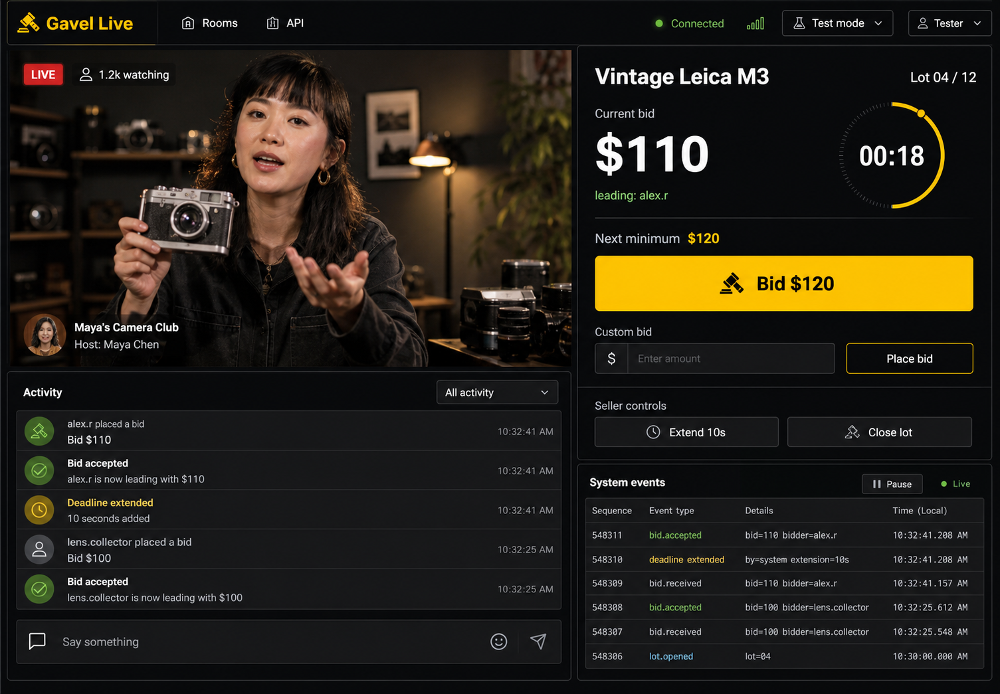

# Gavel Live

A Whatnot-inspired live auction demo built with Cloudflare Workers, Durable Objects, Hono, Zod,
TanStack Start, and React.

[Try the live demo](https://gavel-live-web.aranlucas.workers.dev) ·
[Read the system design](./SYSTEM_DESIGN.md) · [View the API](./openapi.yaml)



## Highlights

- Separate seller and bidder views, with a new bidder identity in each tab.
- One Durable Object owns the state and deadline for each auction.
- SQLite transactions keep bids ordered and safe to retry.
- WebSockets send live updates and recover missed events with a sequence number.
- Staging integration tests cover competing bids, retries, roles, deadlines, alarms, and reconnects.

## How it works

```text
seller and bidders
       │
       ▼
Cloudflare Worker with Hono and Zod
       │
       ▼
one Auction Durable Object per auction
  SQLite state + deadline alarm
       │
       ▼
WebSocket fanout objects → viewers
```

The Auction Durable Object is the only component that can accept a bid or close an auction.
WebSocket fanout only sends saved results to connected clients.

See [SYSTEM_DESIGN.md](./SYSTEM_DESIGN.md) for the full design and interview walkthrough.

## Try it

Open the [live demo](https://gavel-live-web.aranlucas.workers.dev) and select **Launch instant
demo**. Select **Open another bidder** to open the same auction in a new tab with a different bidder
identity.

To run the web app locally, use Node.js 22 or newer and pnpm 11:

```bash
pnpm install
pnpm --filter gavel-live-web dev
```

Open `http://localhost:3000`. The instant demo uses the staging API.

## Development

Start the API at `http://localhost:8787`:

```bash
pnpm dev
```

Run every local check:

```bash
pnpm check
```

This checks generated Cloudflare types, TypeScript, lint rules, formatting, OpenAPI, Worker tests,
the web build, and deployment dry runs.

For local tokens, WebSocket examples, and manual room setup, see
[apps/web/README.md](./apps/web/README.md).

## API

The API can create, start, bid on, close, cancel, read, and subscribe to auctions. It also provides
ordered history for reconnects.

The checked-in [OpenAPI 3.1 file](./openapi.yaml) is generated from the same Zod schemas that check
requests and responses. A running API also serves it from `/openapi.json`.

## Deploy and test

Deploy the API to staging and run the integration tests:

```bash
pnpm deploy:staging
pnpm test:production -- https://cloudflare-live-auction-staging.<account>.workers.dev
```

The tests write a visual report to
[`artifacts/integration-report.html`](./artifacts/integration-report.html). Test auctions remain in
staging because the public API has no delete route.

Deploy the API and web app to production:

```bash
pnpm deploy
pnpm --filter gavel-live-web deploy
```

The instant demo is disabled in production. Staging needs its private demo signing key as an
encrypted secret:

```bash
pnpm exec wrangler secret put DEMO_AUTH_PRIVATE_JWK --env staging
```

Never commit `.auction-auth-private.jwk`.

## Scope

This project focuses on correct bids, deadlines, safe retries, and live delivery. Video, payments,
search, shipping, chat, and moderation are outside the bid transaction.
