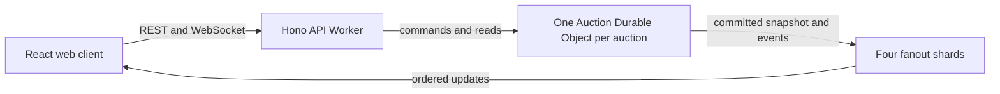

# Gavel Live

Gavel Live is a live-commerce auction demo. Sellers create and run timed auctions, bidders submit
offers, and viewers follow saved changes over WebSockets. The API is built with Cloudflare Workers,
Hono, and Durable Objects; the browser client uses React and TanStack Start.

[Open the live demo](https://gavel-live-web.aranlucas.workers.dev) ·
[Staging API](https://cloudflare-live-auction-staging.aranlucas.workers.dev) ·
[OpenAPI contract](openapi.yaml) · [System design guide](SYSTEM_DESIGN.md)

## Try the demo

Open the live demo and choose **Launch instant demo**. It creates a temporary staging auction and
seller, bidder, and viewer credentials. Use **Open another bidder** to join the same auction in a
separate tab. Demo credentials expire after 15 minutes. The web client also supports a custom API,
auction ID, and test tokens through **Room setup → Advanced setup**.

## Run locally

Requires Node.js 26 or later (see `.node-version`) and the pnpm version declared by the root
`package.json`. From the repository root:

```sh
pnpm install
pnpm dev
```

`pnpm dev` starts the API at `https://api.live-auction.localhost`. In another terminal, start the
web client:

```sh
pnpm --filter gavel-live-web dev
```

The client is available at `https://live-auction.localhost`. Both commands use Portless, which may
ask for permission to bind port 443 and trust a local development certificate on first use. The
local API has demo sessions enabled; configure a matching demo signing key as described in
[Development](docs/development.md) before launching a local instant demo.

## How it works

Each auction ID maps to one Durable Object. That object stores the auction, bids, ordered event
history, retry records, and closing alarm in SQLite. It serializes commands for that auction and
commits a bid and its event together. Four fanout Durable Objects distribute snapshots and events
to WebSocket clients without deciding whether a bid is valid.


```mermaid
flowchart LR
    Browser[React web client] -->|REST and WebSocket| Worker[Hono API Worker]
    Worker -->|commands and reads| Auction[One Auction Durable Object per auction]
    Auction -->|committed snapshot and events| Fanout[Four fanout shards]
    Fanout -->|ordered updates| Browser
```

The API verifies signed JWTs and enforces seller, bidder, and viewer roles. A command uses an
`Idempotency-Key` so the client can safely retry after a lost response. See the
[API guide](docs/api.md) for routes, authentication, and realtime recovery.

## Repository map

| Path                      | Purpose                                                                     |
| ------------------------- | --------------------------------------------------------------------------- |
| `src/index.ts`            | Hono routes, auth and rate-limit middleware, CORS, and error responses      |
| `src/auction.ts`          | Auction Durable Object, SQLite state, transactions, alarms, and idempotency |
| `src/fanout.ts`           | WebSocket fanout and reconnect bootstrap                                    |
| `src/model.ts`            | Shared Zod schemas and API types                                            |
| `apps/web/`               | TanStack Start browser client and Cloudflare Worker config                  |
| `openapi.yaml`            | Generated REST and WebSocket contract                                       |
| `SYSTEM_DESIGN.md`        | Detailed system-design interview guide                                      |
| `docs/`                   | API, development, and deployment guides                                     |
| `test/`, `apps/web/test/` | API, Durable Object, and browser-client tests                               |

## Common commands

```sh
pnpm check                       # Full local check, including builds and deployment dry runs
pnpm test                        # API and web-client unit/integration tests
pnpm openapi:check               # Confirm openapi.yaml matches the source schemas
pnpm --filter gavel-live-web build
pnpm deploy:dry-run              # Dry-run production and staging API deployments
```

See [Development](docs/development.md) for the full command list and test setup, and
[Deployment](docs/deployment.md) for Cloudflare configuration and secrets.

## Contributing and security

Changes to `src/model.ts` can affect both the API and web client. Regenerate the checked-in API
contract with `pnpm openapi`, then run `pnpm check` before submitting a change. Never commit private
signing keys, access tokens, `.dev.vars`, or other credentials. See [Security](SECURITY.md) for
credential handling and vulnerability reports.
