# Live auction system design on Cloudflare

## The 30-second opening

> I’ll design an English ascending live-commerce auction. Viewers see price changes, authenticated bidders submit bids, and the system selects at most one winner. I’ll focus on ordering, deadlines, durability, retry safety, and realtime delivery; video and payment remain adjacent systems.
>
> Every transition for one auction needs one authoritative total order. There is no need for global ordering, so I’ll partition by auction ID and give each auction one logical authority. This project implements that authority with a Durable Object. Realtime sockets can scale separately because they never decide state.

For an interview, keep the first sentence vendor-neutral: use **one logical auction authority per
auction ID**. Then say that this working project implements that authority with a Cloudflare Durable
Object. This demonstrates a concrete design without assuming the interviewer wants Cloudflare.

## 45-minute delivery plan

| Time        | Topic                                                      |
| ----------- | ---------------------------------------------------------- |
| 0:00-5:00   | Scope, functional and nonfunctional requirements           |
| 5:00-7:00   | Core entities                                              |
| 7:00-12:00  | REST, idempotency, authentication, and realtime contracts  |
| 12:00-25:00 | End-to-end working architecture                            |
| 25:00-38:00 | Contention, deadlines, reconnects, fanout, and failures    |
| 38:00-43:00 | Hot-auction scale, multi-region latency, and decomposition |
| 43:00-45:00 | Tradeoffs and summary                                      |

## How the interview might actually go

The goal is not to recite the entire design. Build a small correct system first, make the
correctness boundary explicit, and let the interviewer choose which risks to explore. The dialogue
below is a rehearsal, not a script that must be repeated word for word.

### 0:00-5:00 — Establish scope and success criteria

**Interviewer:** Design a live-auction system.

**Candidate:**

> I’ll design a live-commerce English auction where a seller presents one lot, viewers watch, and
> authenticated bidders submit increasing bids. I’ll focus on bid correctness, closing, retry
> safety, and realtime state. I’ll show video delivery and payment settlement as adjacent systems
> unless you want either designed in depth.

Ask four or five questions, then state assumptions so this phase does not consume the interview:

1. Is this a normal ascending auction or a proxy/max-bid auction?
2. Is there one active lot per show, and can a show contain sequential lots?
3. Is the end a hard deadline, or do bids near the end extend it?
4. Is brief unavailability preferable to accepting bids that could produce conflicting winners?
5. What scale should I target: total concurrent viewers, viewers on one hot auction, and peak bid
   attempts per second?

If the interviewer does not supply scale, continue with explicit working assumptions:

- English ascending auction, one active lot per show.
- Integer minor currency units and a configured minimum increment.
- A bid inside the final ten seconds extends the deadline by ten seconds.
- The prototype targets thousands of viewers on a hot lot; a production design must make fanout
  shard count elastic for exceptionally large shows.
- Payment eligibility is checked before bidding and settlement begins after close. Those checks are
  requirements, not implemented features of this prototype.
- During an ambiguous authority failure, reject or time out bids rather than risk two winners.

Then state the key invariant early:

> Within one auction, bids, seller actions, deadline changes, and close must have one authoritative
> order. We do not need a global order across unrelated auctions, so auction ID is the natural
> partition key.

This sentence should drive the rest of the interview.

### 5:00-7:00 — Name only the core entities

Write these on the board without designing every column:

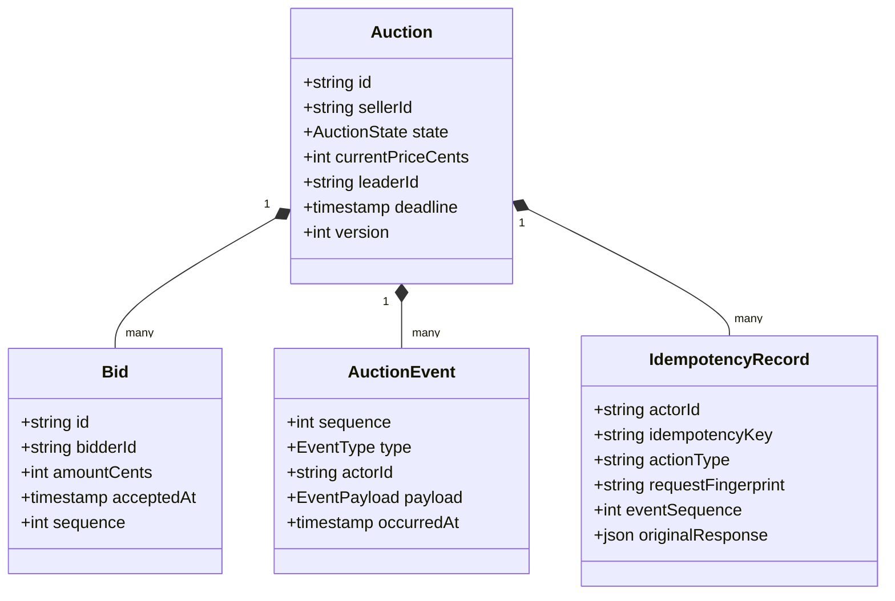

An `IdempotencyRecord` is not another user action and it is not the current auction state. It is the
server’s durable memory of one request:

- `actorId + idempotencyKey` identifies one seller action or bid attempt.
- `fingerprint` records what that request meant, such as “bid 10,000 cents.”
- `originalResponse` is the exact response produced when that request first committed.

> A client can lose a successful response and retry after other bids have occurred. Returning the
> current auction would not be an exact retry. I persist a record containing the complete original
> response under the actor and idempotency key.

For example, bidder A’s `$100` bid commits but its HTTP response is lost. Bidder B then raises the
price to `$110`. When bidder A retries the same key, the idempotency record returns A’s original `$100`
acceptance with `replayed: true`; it does not pretend A originally bid at the newer price.

Do not add users, products, chat, payments, shipments, and video segments to the main auction
transaction. They can be referenced by ID or placed beside the core system later.

### 7:00-12:00 — Define the contracts

Draw or say the minimum API surface:

```http
PUT  /v1/auctions/{auctionId}
GET  /v1/auctions/{auctionId}
POST /v1/auctions/{auctionId}/start
POST /v1/auctions/{auctionId}/bids
POST /v1/auctions/{auctionId}/close
GET  /v1/auctions/{auctionId}/history?afterSequence=N
GET  /v1/auctions/{auctionId}/events?afterSequence=N  # WebSocket upgrade
```

Call out three contract decisions:

- `PUT` creation uses a client-chosen auction ID, so identical creation retries are naturally
  idempotent.
- Mutating `POST` requests require an `Idempotency-Key`; identity comes from a verified JWT, never
  from a bidder ID in JSON.
- Realtime messages contain the authoritative event sequence. WebSocket delivery is recoverable,
  not the source of truth.

If asked why WebSockets rather than polling, say that polling is still a recovery and fallback
interface, while WebSockets reduce state-change latency and repeated reads for live viewers.

Keep seller and bidder authority separate:

| Actor  | Allowed mutations                                              |
| ------ | -------------------------------------------------------------- |
| Seller | Create, start, close after the deadline, or cancel its auction |
| Bidder | Place an idempotent bid on a live auction                      |
| Viewer | Read state/history and subscribe to realtime events            |

A seller token cannot bid, and a bidder token cannot start, close, or cancel an auction.

### 12:00-25:00 — Draw the smallest complete architecture

Build the design in layers. Each layer answers a requirement introduced earlier and preserves the
same correctness boundary. Do not draw the final platform all at once.

#### Complexity 1 — One correct request path

Start with only the boxes needed to accept a bid correctly:

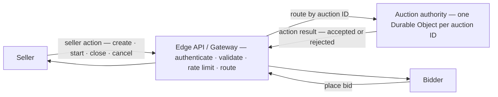

Say: “Every request for auction A reaches the same logical owner. Different auction IDs resolve to
different owners and scale independently.” At this point you have established ordering without
discussing storage, sockets, video, or payments.

The gateway is the stateless public server. In this project it is a Cloudflare Worker running Hono.
The Durable Object is the stateful auction owner; only it can accept or reject an action. A
committed event is added in complexity 3, and the idempotency record is added inside storage in
complexity 2. The gateway is not another origin server placed in front of the Worker; it is the
logical role the Worker performs.

#### Complexity 2 — Make correctness durable

Now open the authority box and add only the state needed for retries and deadlines:

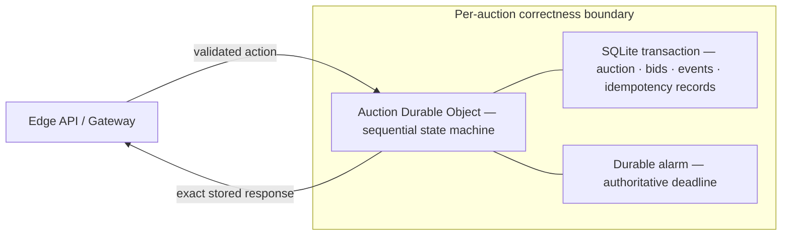

This layer explains durable idempotency, anti-sniping, recovery after eviction, and at-most-one
winner. The bid, price, event, idempotency record, and any deadline change commit together.

#### Complexity 3 — Add realtime delivery without weakening correctness

Only after the write path is correct, add the simplest realtime path:

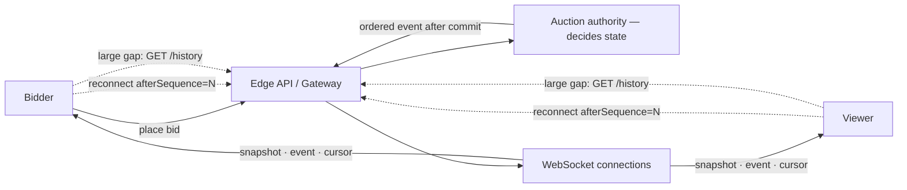

The authority still makes every auction decision; realtime delivery only reports committed state.
Do not add fanout shards to the interview drawing unless audience scale becomes the chosen deep
dive. The complete production diagram later splits WebSocket delivery into shards.

#### Complexity 4 — Add adjacent product systems

Finish with the systems intentionally kept outside the bid transaction:

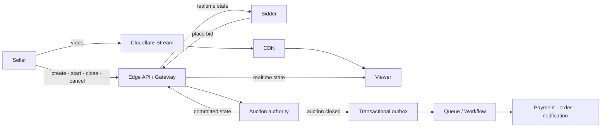

Video may lag and settlement may retry, but neither participates in choosing the winning bid. The
complete reference diagram later in this guide is the combination of these four layers.

Say this while drawing the authority:

> Every action request for auction A resolves to the same logical object. That object processes state
> transitions sequentially and stores the auction, bids, events, and idempotency records together.
> This gives me a single-writer state machine without a distributed lock. Auctions B and C resolve
> to different objects and scale independently.

Then distinguish decision making from delivery:

> The authority accepts or rejects bids. Realtime delivery only distributes the result. If delivery
> is slow or unavailable, it must not change the winning bid.

After complexity 2, the design is already complete enough to be correct. Complexity 3 makes it
usable for a live audience, and complexity 4 makes the product boundary explicit. Ask the
interviewer where they want to go deeper while offering the most important choices:

> The highest-risk areas are simultaneous bids, exact retries, closing at the deadline, and the
> snapshot-to-WebSocket race. I can start with bid contention and closing unless you prefer realtime
> or multi-region latency.

### 25:00-38:00 — Drive the correctness deep dives

#### Deep dive 1: two simultaneous equal bids

Draw two requests entering the same authority:

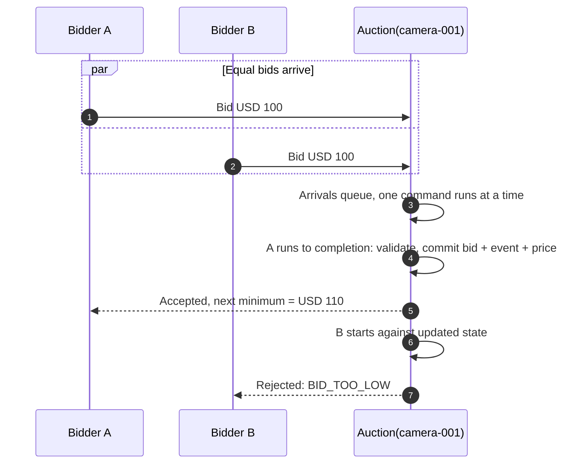

Explain the word before the interviewer asks. “Serialize” means the authority turns concurrent
arrivals into a queue: once both bids are routed to the same object there is no “simultaneous,”
only first and second. The first command runs to completion, including its storage transaction,
and the second command evaluates against the first command’s committed result. B is not rejected
by a lock; B is rejected because it is second and the minimum is now USD 110.

> The race never happens; routing resolves it. One auction ID always resolves to one sequencer,
> and the sequencer finishes each command before starting the next. It is `synchronized
(auctionId)` provided by the platform — a single-writer state machine without a distributed lock.

The important answer is still not merely “single threaded.” The unit of serialization is the whole
command: the accepted bid, price update, event, idempotency record, and any deadline extension
must commit in one storage transaction, and no new request is delivered while that transaction is
in flight (Durable Objects call this the input gate). If the object read the price, yielded, and
wrote later, another bid could interleave. No external cache is allowed to decide the current
minimum.

If the interviewer proposes a conventional database instead, note that row locks serialize the
transition too, but only the SQL statement sits inside the lock. Here the entire business rule —
deadline check, anti-snipe extension, alarm update, event append, idempotency write — is one
serialized unit.

#### Deep dive 2: the response is lost

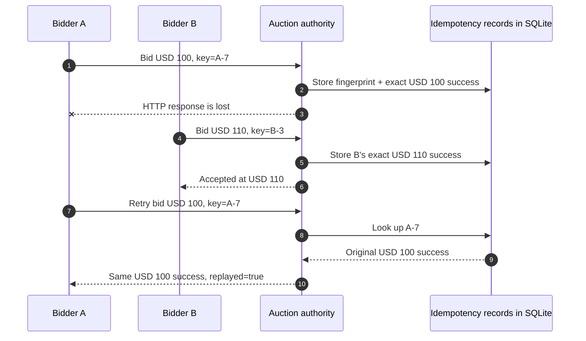

The idempotency record is why A does not receive the current `$110` state as if it were A’s original
result. Reusing `A-7` with a different amount does not match the stored fingerprint and returns
`IDEMPOTENCY_KEY_REUSED`.

This is a strong opportunity to correct “exactly once” language:

> Networks do not give exactly-once delivery. This design gives effectively-once state transitions
> for cooperating clients through durable idempotency; realtime event delivery remains at least
> once and cursor-recoverable.

#### Deep dive 3: deadline and anti-sniping

Use server time only. A bid transaction reads the persisted deadline, rejects late bids, and, when
inside the anti-snipe window, updates the deadline and storage alarm atomically. The alarm closes
the auction idempotently. Reads and bids also run close-if-due so a delayed alarm cannot leave an
expired auction accepting bids.

If the interviewer asks about a bid arriving at the exact deadline:

> The authority compares its server time to the persisted deadline. Client timestamps are not
> trusted. The ordering is deterministic at the authority, although geographically distant users
> may experience different network latency; that is a product-fairness tradeoff, not something
> client clocks can safely fix.

#### Deep dive 4: reconnect without missing an event

Explain the snapshot/subscribe gap: if a client reads a snapshot and an event commits before its
subscription becomes active, it can miss the event. This design makes a fanout shard bootstrap the
socket as not-ready, fetch the authoritative snapshot and cursor, replay messages that arrived
during bootstrap, and only then mark the socket ready.

Clients reconnect with `afterSequence`. A bounded gap is replayed from the shard; a larger gap sets
`resyncRequired`, causing the client to fetch authoritative history.

### 38:00-43:00 — Scale and challenge your own design

Separate three scaling dimensions:

| Dimension                   | Scaling response                                                         |
| --------------------------- | ------------------------------------------------------------------------ |
| Number of auctions          | Partition naturally by auction ID across authority objects.              |
| Viewers on one auction      | Add fanout shards; sockets never write auction state.                    |
| Bid attempts on one auction | One sequencer is intentional; benchmark and shed abusive/duplicate load. |

Be explicit that one exceptionally hot auction is the difficult case. The current model uses four
fixed fanout shards and an application cap per shard. A production system would choose the shard
count from audience size, use an assignment directory or stable rendezvous hashing, and load-test
the authority’s sequential bid capacity. Do not invent a throughput number without measurement.

For global bidders, acknowledge that the authority has one physical location and therefore one
region has a latency advantage. Reasonable options are locating the authority near the expected
audience, showing a deadline adjusted for estimated latency only as UI, or changing the product to
scheduled bid windows/proxy bidding. Multi-primary bid acceptance would require consensus and is a
major increase in complexity.

### 43:00-45:00 — Close with the design and its limitation

Use a compact summary:

> I partition by auction ID and use one Durable Object as the auction’s sequencer, transactional
> store, and deadline owner. JWT-authenticated, schema-validated actions reach that authority;
> SQLite transactions and durable idempotency protect bid correctness. Alarms plus close-if-due
> recovery select at most one winner. Separate fanout objects distribute ordered events, while
> cursors and history repair disconnects. Video and settlement are asynchronous adjacent systems.
> The main tradeoffs are single-auction sequential throughput, geographic latency to one authority,
> and Cloudflare-specific operations.

Then stop. Leave the final minute for the interviewer rather than adding unrelated services.

## Whiteboard build order

If you tend to lose time while drawing, use this sequence:

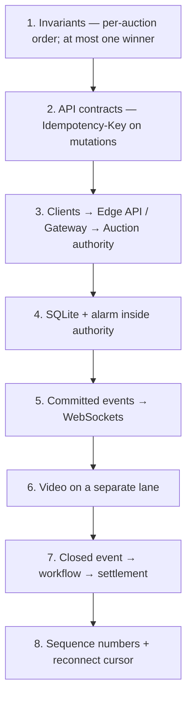

Avoid beginning with every Cloudflare product. Each box should answer a requirement or a failure
mode already established in the conversation.

## Likely interviewer pushback

### Why not Kafka plus a conventional database?

That is a valid alternative. Partitioning a command log by auction ID can also provide ordering,
but the design must coordinate log consumption, transactional state, idempotency records, timers, and
realtime gateways. Durable Objects collapse those responsibilities into one per-entity execution
and storage boundary. Kafka may be preferable for portability, extremely high aggregate event
throughput, or an organization that already operates it.

### Why not put every viewer socket on the authority object?

Correctness work and bulk delivery would then contend for the same object. A slow or extremely
large audience could delay bid processing. Fanout shards isolate socket lifecycle and broadcast
cost while keeping the authority as the only state machine.

### What if the bid commits but event publication fails?

The bid remains correct and a reconnect repairs state from the authority/history. The prototype’s
post-commit publication can delay a live update for an already-connected viewer until a later
refresh. Production should add a transactional outbox in the authority and retry publication until
acknowledged. Do not claim the current `waitUntil` publication closes that failure window.

### How do you prevent fake bidders or cross-auction demo credentials?

The edge verifies JWT signature, issuer, audience, expiry, subject, and role. The browser’s demo
tokens also contain an auction scope, which middleware checks before object lookup. A production
system would add account status, auction membership, payment eligibility, risk controls, and
possibly bid limits; a role claim alone is only the prototype’s authorization model.

### What happens with 100,000 viewers on one lot?

Do not send 100,000 socket writes through the authority. Increase delivery shards, assign viewers
deterministically, cap each shard, and use bounded replay plus authoritative history. The number of
shards is a capacity-planning result, not a correctness constant.

### Can you guarantee fairness for a bidder on another continent?

The system guarantees one authoritative arrival order, not equal network latency. Trusting client
timestamps would create a fraud and clock-skew problem. Product mitigations include proxy bidding,
longer anti-snipe extensions, or regional eligibility rules. True active-active acceptance requires
consensus on each auction’s order.

### Is the auction closed exactly once?

The close state transition is idempotent and records one authoritative close event. The alarm may
be delivered more than once, and downstream payment messages may be delivered more than once, so
consumers still need idempotency. Say “one durable state transition,” not “the network runs once.”

## What the working project proves

The implementation is useful interview evidence, but it should support the design rather than
replace reasoning:

| Design claim                              | Project evidence                                                                                                                                       |
| ----------------------------------------- | ------------------------------------------------------------------------------------------------------------------------------------------------------ |
| Edge authentication and schema validation | [`src/index.ts`](./src/index.ts), [`src/auth.ts`](./src/auth.ts)                                                                                       |
| One authority selected by auction ID      | [`src/index.ts`](./src/index.ts), [`src/auction.ts`](./src/auction.ts)                                                                                 |
| Transactional state and idempotency       | [`src/auction.ts`](./src/auction.ts)                                                                                                                   |
| Typed event and API boundaries            | [`src/model.ts`](./src/model.ts), [`openapi.yaml`](./openapi.yaml)                                                                                     |
| Sharded recoverable WebSocket delivery    | [`src/fanout.ts`](./src/fanout.ts)                                                                                                                     |
| Contention, alarms, roles, and reconnects | [`test/auction.spec.ts`](./test/auction.spec.ts), [`test/durable-object.integration.spec.ts`](./test/durable-object.integration.spec.ts)               |
| Deployed end-to-end behavior              | [`scripts/production-integration.ts`](./scripts/production-integration.ts), [`artifacts/integration-report.html`](./artifacts/integration-report.html) |

Be honest about what it does not prove: real payment eligibility, video ingest, searchable
catalogs, dynamic fanout shard assignment, 100,000-viewer load, and transactional outbox delivery
remain production extensions.

## Common interview mistakes

- Starting with product names instead of requirements and invariants.
- Saying a cache or WebSocket server owns the current price.
- Using client timestamps to decide whether a deadline bid counts.
- Saying “exactly once” without defining idempotency and delivery semantics.
- Adding Kafka, queues, D1, KV, and multiple regions before completing one correct bid flow.
- Ignoring the response-lost-after-commit case.
- Letting fanout failure roll back or invalidate an accepted bid.
- Claiming fixed per-object throughput without a benchmark.
- Spending half the interview on video encoding when bid correctness is the core problem.

## 1. Requirements and invariants

Assume an English auction with one logical lot, server time, integer minor currency units, minimum increments, and an optional anti-sniping extension. Payment eligibility is checked before bidding; capture begins asynchronously after close. Correctness is preferred over accepting bids during ambiguous failure.

The principal invariants are:

1. One auction has one state-transition order and monotonically increasing event sequence.
2. A bid is accepted only while `LIVE`, before the authoritative deadline, and at or above the current minimum.
3. One accepted command produces one durable event; a retry returns its original result.
4. A deadline and its alarm change atomically with the state transition that establishes them.
5. Closing is idempotent and chooses at most one winner.
6. Realtime delivery can duplicate or disconnect, but clients can recover from an authoritative cursor.

## 2. Entities and interfaces

- `Auction`: seller, prices, state, leader, winner, bid count, configuration, timestamps, and version.
- `Bid`: server-generated ID, bidder, amount, accepted timestamp, and sequence.
- `AuctionEvent`: discriminated type and payload, actor, time, and authoritative sequence.
- `IdempotencyRecord`: actor, idempotency key, action type, request fingerprint, event sequence, and the exact original response JSON used to replay a request safely.
- `FanoutMessage`: resulting snapshot, event, and cursor retained on one delivery shard.

Important API choices:

- `PUT /v1/auctions/{auctionId}` gives creation a stable, naturally retryable identity.
- JWT `sub` determines actor identity; a verified `role` claim determines authorization. Bidder IDs never come from request JSON.
- Every mutating `POST` requires `Idempotency-Key`.
- `GET /history?afterSequence=N` is the full recovery interface.
- `GET /events?afterSequence=N` upgrades using subprotocols `auction.v1` and `auth.<JWT>` and begins with a snapshot/catch-up envelope.
- `GET /openapi.json` exposes the Zod-derived OpenAPI contract.

Example bid:

```http
POST /v1/auctions/camera-001/bids
Authorization: Bearer <short-lived JWT>
Idempotency-Key: bidder-42-attempt-7
Content-Type: application/json

{"amountCents":2300}
```

## 3. Complete architecture after the progressive build

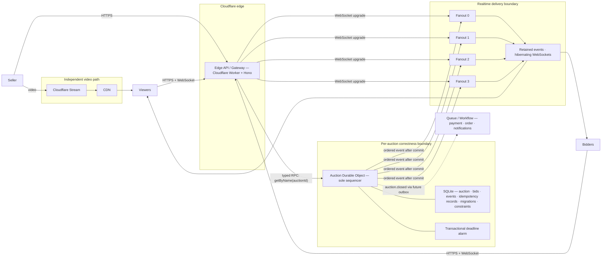

The Edge API / Gateway is a stateless protocol and policy layer, not the auction owner. A Cloudflare
Worker running Hono implements it: middleware authenticates, validates, and rate limits before
calling the named Durable Object binding. This is why an `auctionStub` helper is unnecessary:
`env.AUCTIONS.getByName(id)` is already the typed Cloudflare RPC reference. Importing the `Auction`
class would call a local class and bypass the remote object's identity, storage, and serialization
boundary.

## 4. Critical flows

### Create and start

1. The Edge API / Gateway verifies JWT issuer, audience, signature, expiry, subject, and role before object lookup.
2. Zod validates the auction ID, headers, and strict JSON body.
3. The named `Auction` object applies any pending numbered SQLite migrations.
4. Create inserts the draft and `auction.created` event atomically.
5. Start checks ownership/idempotency, moves `DRAFT → LIVE`, writes its full replay response, and installs the alarm in the same storage transaction.
6. Only after commit does the authority enqueue fanout publication with `waitUntil`.

### Place a bid

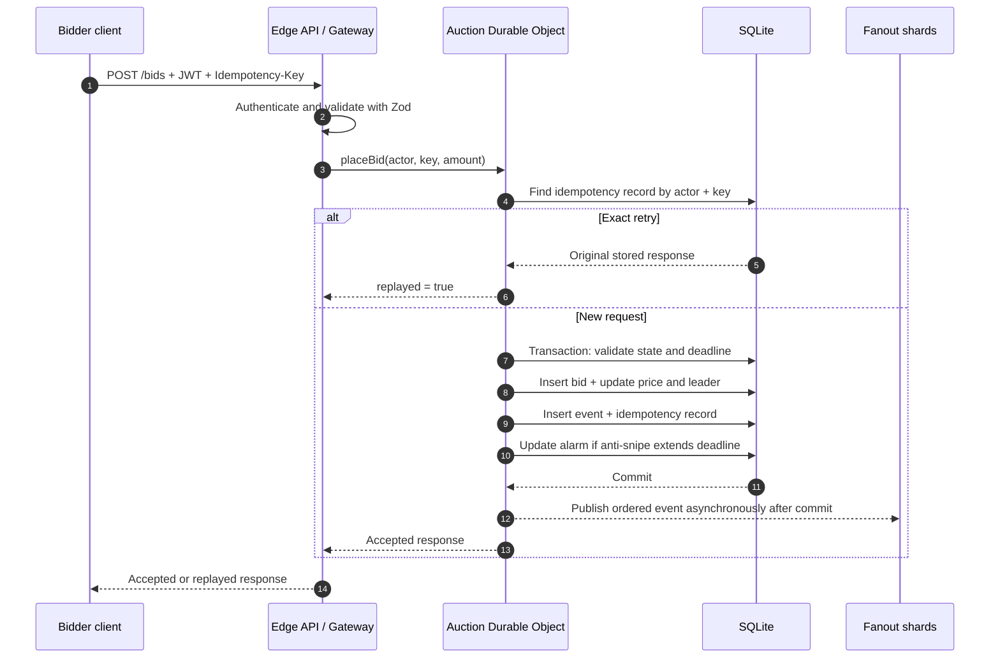

1. Rate limiting and validation occur before the authority lookup.
2. The object checks the `(actor, idempotency key)` record first. If its fingerprint matches, it returns the stored original response—even if later bids occurred or the deadline passed.
3. Otherwise, inside one synchronous storage transaction it checks state/time, calculates the minimum, inserts the bid, updates auction state, records the typed event, stores the idempotency record, and changes the alarm if extended.
4. Database triggers independently reject impossible price/state/sequence combinations.
5. After commit, the authority publishes the resulting event/snapshot to four fanout shards.

Two equal simultaneous bids reach the same authority. One advances state; the next observes the higher minimum and fails. A distributed lock is unnecessary.

### Close

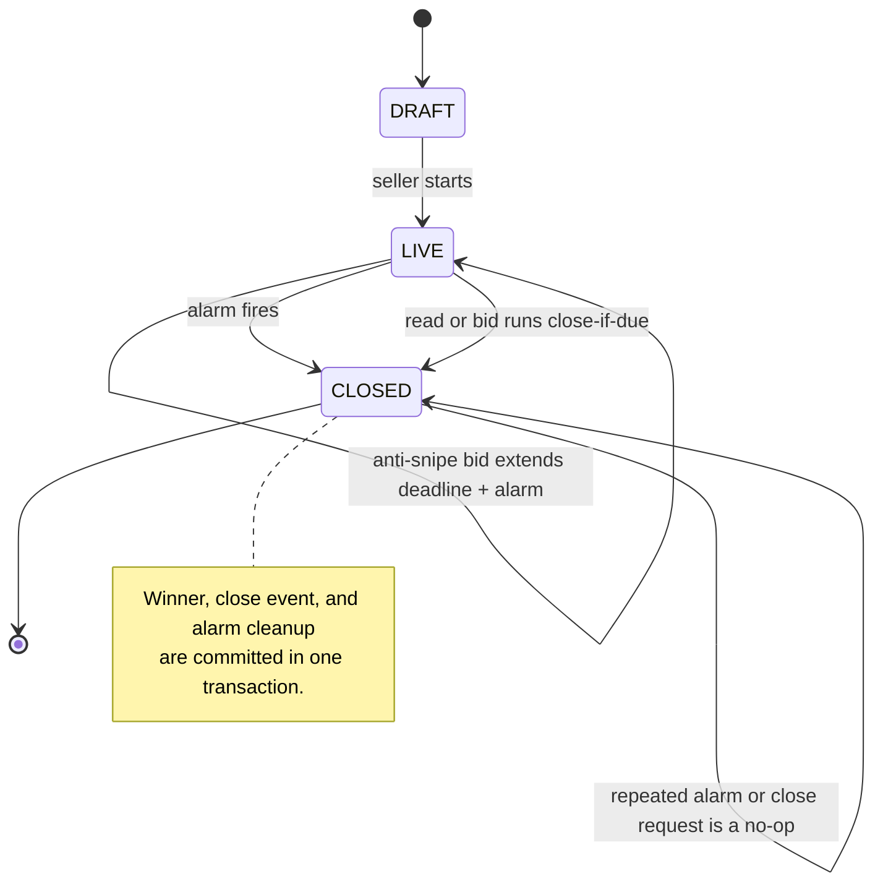

The persisted server deadline is authoritative. The alarm transitions `LIVE → CLOSED` once, freezes the current leader as winner, records `auction.closed`, and clears the alarm transactionally. If alarm delivery repeats, closed state makes it harmless. A read or bid also performs close-if-due, covering delayed alarm execution.

### Realtime reconnect

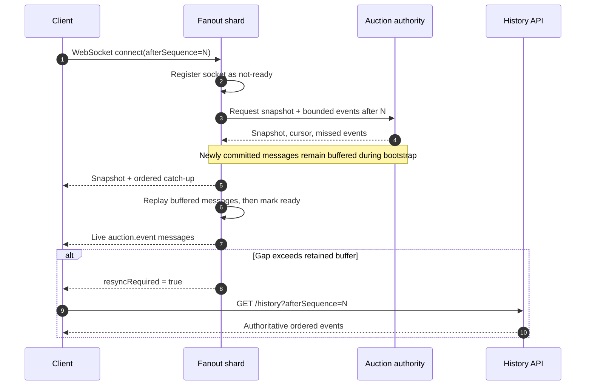

Viewer identity hashes to one of four fanout objects. The shard accepts the socket as not-ready, asks the authority for a snapshot and bounded events after the requested cursor, then replays any messages that arrived during bootstrap before marking the socket ready. This avoids the snapshot/subscribe gap.

Every message has the authority's sequence. Clients persist the latest cursor, ignore duplicates, reconnect with `afterSequence`, and use `/history` when the snapshot says `resyncRequired`. Fanout delivery is therefore at least once; state transitions remain exactly once under idempotent retries.

## 5. Failure analysis

| Failure                            | Behavior                                                             |
| ---------------------------------- | -------------------------------------------------------------------- |
| Accepted response is lost          | Retry same key; receive the exact original snapshot and event.       |
| Same key has different input       | Fingerprint mismatch returns `IDEMPOTENCY_KEY_REUSED`.               |
| Equal bids race                    | Single authority serializes them; only the first meets the minimum.  |
| Authority evicts/restarts          | SQLite, alarm, and idempotency records restore correctness state.    |
| Alarm retries or is delayed        | Close is idempotent; reads/bids also close overdue state.            |
| Fanout publish fails               | Bid remains committed; client snapshot/history repairs delivery.     |
| Socket drops during bootstrap      | Reconnect cursor repeats safely and closes the subscribe gap.        |
| One fanout shard fills             | It returns 503; other shards and bid acceptance remain independent.  |
| Payment provider fails             | Auction remains closed; a future Workflow retries settlement.        |
| Authority partition is unavailable | Reject/time out that auction rather than create conflicting winners. |

## 6. Scaling and Cloudflare tradeoffs

Different auctions scale horizontally by ID. A single popular auction deliberately remains a single writer; bid throughput is bounded by one object's sequential work. The four delivery shards prevent viewer socket writes from dominating that correctness object, but they are a fixed working-model partition count. Production can choose shard count from audience forecasts or add an assignment directory.

The object's location also matters: a globally distributed audience pays network latency to one authority. Locating it near the seller or expected bidder population helps, but multi-primary bidding would require consensus and restore the complexity this design removes.

Cloudflare compresses the architecture—compute, object identity, SQLite, alarms, and hibernating sockets share one platform—but creates vendor-specific code, migrations, limits, and operations. Rate limiting is an abuse-control hint, not a correctness primitive. Deployed staging tests remain necessary because local simulation does not prove Cloudflare routing, placement, alarms, or limit behavior.

## 7. Production decomposition

- D1 or another database provides searchable catalog, seller dashboards, and archive read models; it is never authoritative for bid acceptance.
- Cloudflare Stream carries video independently. Clients overlay price and deadline from auction events because video may lag.
- Queues plus Workflows consume a transactional outbox for payment capture, orders, notifications, analytics, and retries.
- An external OIDC provider supplies short-lived JWTs and a remotely rotated JWKS. Application authorization may need a role/membership lookup rather than trusting a generic identity-provider claim.
- Observability correlates `X-Request-Id`, `CF-Ray`, auction ID, event sequence, and asynchronous settlement IDs.

## Final interview summary

> The system partitions by auction ID. One Durable Object is the sole sequencer, transactional store, and deadline owner for that auction. Typed Hono routes and Zod protect the edge; verified JWT claims establish identity. SQLite transactions, database constraints, and complete idempotency responses protect bids. Alarms plus recovery paths close exactly once. Four hibernating fanout objects distribute ordered events without entering the correctness boundary, and cursor/history recovery handles disconnects. Video and settlement remain asynchronous adjacent systems.
