# Live auction system design on Cloudflare

## The 30-second opening

> I'll design an English ascending live-commerce auction. Viewers see price changes, signed-in bidders place higher bids, and the system picks no more than one winner. I'll focus on bid order, deadlines, durable state, safe retries, and live updates. Video and payment are separate systems.
>
> Every saved change to one auction needs one official order. Unrelated auctions do not need to share an order. I can split the work by auction ID and give each auction one logical authority. This project uses a Durable Object for that authority. WebSockets can scale separately because they only deliver results. They do not decide which bid wins.

In an interview, start with "one logical auction authority per auction ID." This describes the
design without tying it to a vendor. This project uses a Cloudflare Durable Object as that
authority.

## Terms used in this guide

| Term            | Plain meaning                                                     |
| --------------- | ----------------------------------------------------------------- |
| Authority       | The only component allowed to decide the state of one auction.    |
| Commit          | Save a change successfully so it survives a restart.              |
| Idempotent      | Safe to repeat without applying the same change twice.            |
| Idempotency key | A request ID that lets the server recognize a retry.              |
| Fanout          | Send one saved auction update to many connected viewers.          |
| Cursor          | The sequence number of the last event a client received.          |
| Invariant       | A rule the system must never break.                               |
| State machine   | The allowed auction states and the rules for moving between them. |

## 45-minute delivery plan

| Time        | Topic                                                      |
| ----------- | ---------------------------------------------------------- |
| 0:00-5:00   | Scope, functional and nonfunctional requirements           |
| 5:00-7:00   | Core entities                                              |
| 7:00-12:00  | REST, retry safety, authentication, and live update APIs   |
| 12:00-25:00 | Complete working architecture                              |
| 25:00-38:00 | Contention, deadlines, reconnects, fanout, and failures    |
| 38:00-43:00 | Hot-auction scale, multi-region latency, and decomposition |
| 43:00-45:00 | Tradeoffs and summary                                      |

## How the interview can go

Do not try to recite the whole design. Start with a small system that handles bids correctly. Show
which component owns that correctness, then let the interviewer choose what to examine next. Use
the dialogue below to practice. You do not need to repeat it word for word.

### 0:00-5:00: Set the scope and goals

**Interviewer:** Design a live-auction system.

**Candidate:**

> I'll design a live-commerce English auction where a seller presents one lot, viewers watch, and
> signed-in bidders place higher bids. I'll focus on correct bids, closing, safe retries, and live
> state updates. I'll show video delivery and payment settlement as separate systems
> unless you want either designed in depth.

Ask four or five questions. If the interviewer does not answer one, state your assumption and move
on:

1. Is this a normal ascending auction, or does each bidder enter a maximum and let the system bid
   for them?
2. Is there one active lot per show, and can a show contain sequential lots?
3. Is the end a hard deadline, or do bids near the end extend it?
4. Is brief unavailability preferable to accepting bids that could produce conflicting winners?
5. What scale should I target: total concurrent viewers, viewers on one hot auction, and peak bid
   attempts per second?

If the interviewer does not give you scale numbers, use these assumptions:

- English ascending auction, one active lot per show.
- Prices use whole minor currency units, such as cents, with a configured minimum increase.
- A bid inside the final ten seconds extends the deadline by ten seconds.
- The prototype targets thousands of viewers on one popular lot. A production system must be able
  to add fanout shards for much larger shows.
- Payment eligibility is checked before bidding and settlement begins after close. Those checks are
  requirements, not implemented features of this prototype.
- If the auction authority may be unavailable, reject or time out bids instead of risking two
  winners.

State the main rule early:

> Within one auction, accepted bids, seller actions, deadline changes, and closing must have one
> official commit order. Unrelated auctions do not need a shared order, so I split the work by
> auction ID.

Use this rule to guide every later choice.

### 5:00-7:00: Name the core entities

Write these on the board without designing every column:

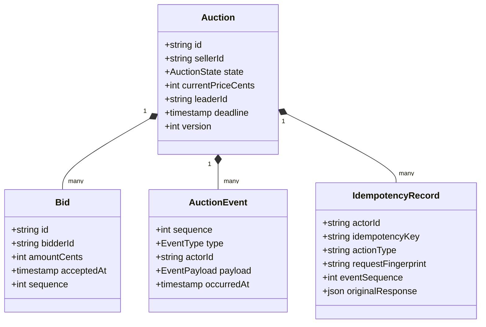

An `IdempotencyRecord` is the server's saved memory of one request. It is separate from the current
auction state:

- `actorId + idempotencyKey` identifies one seller action or bid attempt.
- `fingerprint` records what the request meant, such as "bid 10,000 cents."
- `originalResponse` is the exact response produced when the request first saved successfully.

> A client can lose a successful response and retry after later bids. Returning the current auction
> would give it a different result. I save the complete original response under the actor and
> idempotency key.

For example, bidder A's `$100` bid succeeds, but its HTTP response is lost. Bidder B then raises the
price to `$110`. When bidder A retries the same key, the record returns A's original `$100` success
with `replayed: true`. It does not return the newer `$110` state as A's result.

Keep users, products, chat, payments, shipments, and video segments outside the main auction
transaction. Refer to them by ID or add them as separate systems later.

### 7:00-12:00: Define the API contracts

Draw or say the minimum API surface:

```http
PUT  /v1/auctions/{auctionId}
GET  /v1/auctions/{auctionId}
POST /v1/auctions/{auctionId}/start
POST /v1/auctions/{auctionId}/bids
POST /v1/auctions/{auctionId}/close
GET  /v1/auctions/{auctionId}/history?afterSequence=N
GET  /v1/auctions/{auctionId}/events?afterSequence=N  # WebSocket upgrade
```

Explain three API choices:

- `PUT` creation uses a client-chosen auction ID, so identical creation retries are naturally
  idempotent.
- Mutating `POST` requests require an `Idempotency-Key`; identity comes from a verified JWT, never
  from a bidder ID in JSON.
- Live messages contain the official event sequence. WebSocket delivery can be repaired and does
  not own auction state.

Polling is still the fallback and recovery method. WebSockets show changes sooner and avoid
repeated reads for live viewers.

Give each role separate permissions:

| Actor  | Allowed mutations                                              |
| ------ | -------------------------------------------------------------- |
| Seller | Create, start, close after the deadline, or cancel its auction |
| Bidder | Place an idempotent bid on a live auction                      |
| Viewer | Read state/history and subscribe to live events                |

A seller token cannot bid, and a bidder token cannot start, close, or cancel an auction.

### 12:00-25:00: Draw the smallest complete architecture

Add one layer at a time. Each layer should solve a requirement without changing which component
owns auction correctness.

#### Complexity 1: One correct request path

Start with only the boxes needed to accept a bid correctly:

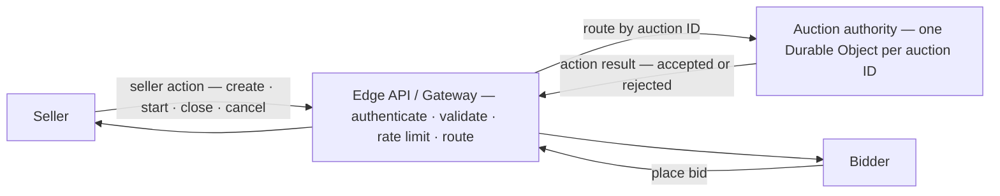

"Every request for auction A reaches the same logical owner. Different auction IDs have different
owners and scale independently." This explains order without adding storage, sockets, video, or
payments.

The gateway is the public server and holds no auction state. In this project, it is a Cloudflare
Worker running Hono. The Durable Object owns the auction state and is the only component that can
accept or reject an action. Complexity 2 adds stored idempotency records. Complexity 3 adds events
after they commit. The gateway is not a separate origin server in front of the Worker. "Gateway"
is the role that the Worker performs.

#### Complexity 2: Save the state needed for correct results

Inside the authority, add the state needed for safe retries and deadlines:

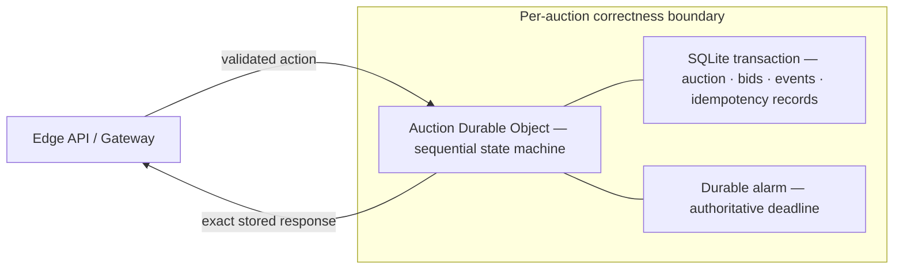

This state supports safe retries, deadline extensions for last-second bids, recovery after a
Durable Object restart or eviction, and no more than one winner. The bid, price, event,
idempotency record, and any deadline change save in one transaction.

#### Complexity 3: Add live updates

Once the bid path is correct, add the simplest live update path:

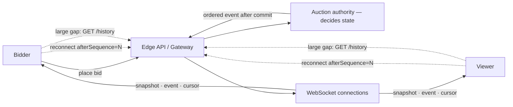

The authority still makes every auction decision. Live delivery only reports saved state. Leave
fanout shards out of this first drawing unless the interviewer asks about audience scale. The full
production diagram adds separate WebSocket shards.

#### Complexity 4: Add the other product systems

Add the systems that stay outside the bid transaction:

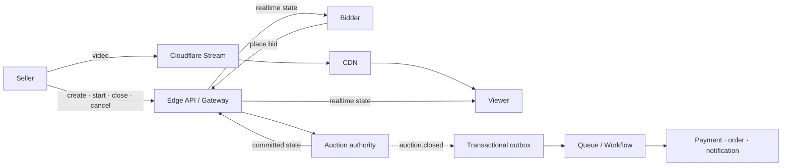

Video may be behind live auction state, and settlement may retry. Neither system chooses the
winning bid. The full diagram later in this guide combines all four layers.

Explain the authority this way:

> Every action for auction A reaches the same logical object. That object puts saved state changes
> in one order. It stores the auction, bids, events, and idempotency records together. This gives me
> one writer for each auction without a distributed lock. Auctions B and C use different objects
> and scale independently.

Separate decisions from delivery:

> The authority accepts or rejects bids. Live delivery only sends the result. If delivery
> is slow or unavailable, it must not change the winning bid.

After complexity 2, the auction can already choose a winner correctly. Complexity 3 serves a live
audience. Complexity 4 shows the rest of the product. Ask which risk the interviewer wants to
examine:

> The highest-risk areas are bids that arrive together, exact retries, closing at the deadline, and
> an event arriving between the first snapshot and the WebSocket subscription. I can start with
> competing bids and closing unless you prefer live delivery or multi-region latency.

### 25:00-38:00: Explain the hard correctness cases

#### Deep dive 1: two simultaneous equal bids

Draw two requests entering the same authority:

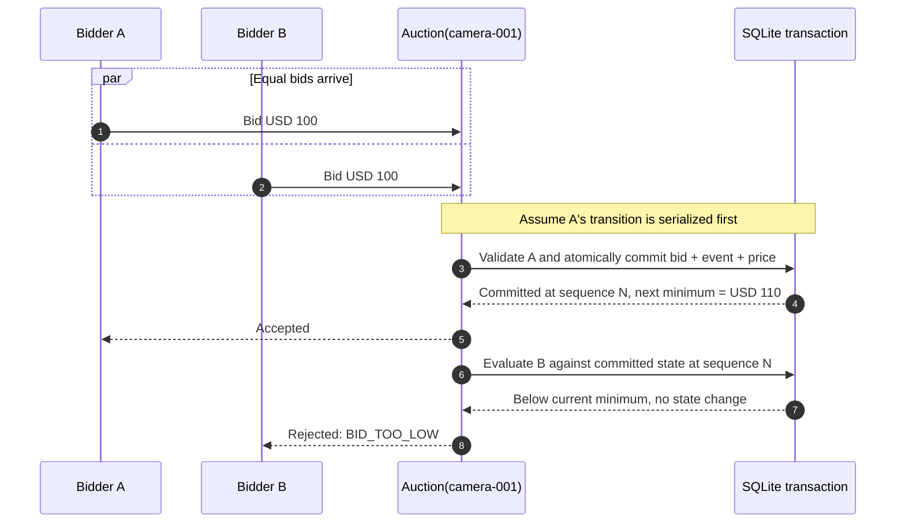

Here, "serialize" means the authority gives saved state changes one commit order. It does not mean
global first-in-first-out order, click order, or that every async RPC method runs from start to
finish without another event running. The diagram puts A first only as an example. Network arrival
and runtime scheduling could put B first.

| Scope                                   | Guarantee                                                                   |
| --------------------------------------- | --------------------------------------------------------------------------- |
| Same auction ID                         | Routes to one logical object with private storage.                          |
| Calls made on the same stub             | Arrive in the order that caller made them.                                  |
| Calls from different clients or Workers | Have no global first-in-first-out or client-time order.                     |
| Local SQLite state change               | Fully commits or fully rolls back under storage concurrency controls.       |
| Code around an external `await`         | May overlap another event, so the whole method is not automatically locked. |
| Different auction IDs                   | Use independent objects and share no order.                                 |

> One auction ID reaches one authority. That authority gives saved state changes one order. Each
> change reads the result of the change before it. This gives each auction one writer without a
> distributed application lock. It is not a global first-in-first-out queue.

Calling the object "single threaded" is not enough. All work that decides a bid stays inside local
transactional storage. The deadline check, bid insert, price and leader update, event append,
idempotency record, and alarm change commit together. Storage input gates and the SQLite
transaction protect this work. An external `fetch()`, Workers KV call, or unrelated `await` could
let another event run. Keep those calls outside the state read and bid commit. An external cache
must never decide the current minimum.

A row transaction in a normal database can also put these changes in order. The Durable Object
combines routing by auction ID, code execution, private storage, and the deadline alarm in one
place. You still must define the transaction correctly.

#### Deep dive 2: the response is lost

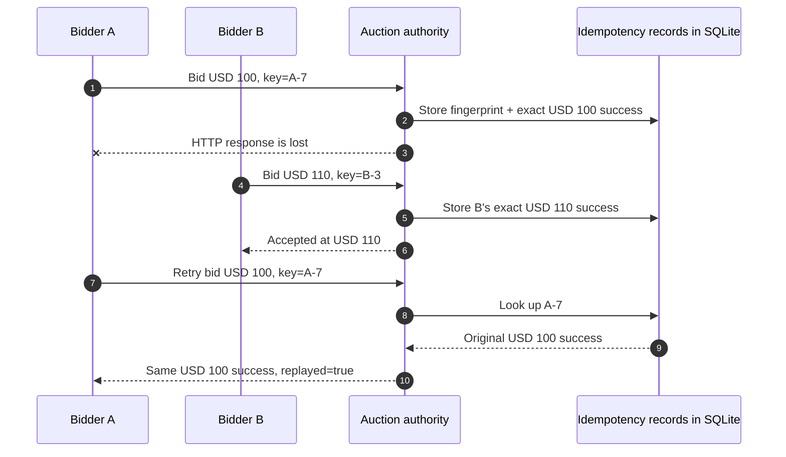

The idempotency record stops A from receiving the current `$110` state as its original result.
Reusing `A-7` with a different amount does not match the stored fingerprint and returns
`IDEMPOTENCY_KEY_REUSED`.

Be precise about "exactly once":

> Networks do not give exactly-once delivery. Durable idempotency makes each action change state
> effectively once when clients reuse their key. Live event delivery remains at least
> once and cursor-recoverable.

#### Deep dive 3: deadline and anti-sniping

Use only server time. A bid transaction reads the saved deadline and rejects late bids. A bid in
the anti-snipe window updates the deadline and storage alarm in the same transaction. The alarm can
safely try to close the auction more than once. Reads and bids also close an overdue auction, so a
late alarm cannot leave it open for new bids.

If the interviewer asks about a bid arriving at the exact deadline:

> The authority compares server time with the saved deadline. It does not trust client timestamps.
> Once transactions have an order, saved state determines each result. Network and scheduling
> delays still decide which client gets into that order first. Client clocks cannot safely make
> that choice fair.

#### Deep dive 4: reconnect without missing an event

There is a gap between reading a snapshot and starting a subscription. An event that saves during
that gap could be missed. To prevent this, the fanout shard first marks the socket as not ready. It
gets the official snapshot and cursor, replays messages that arrived during setup, and then marks
the socket ready.

Clients reconnect with `afterSequence`. The shard can replay a limited number of missed events. If
the gap is too large, it sets `resyncRequired`, and the client gets the official history.

### 38:00-43:00: Explain scale and limits

Scale depends on three different things:

| Dimension                   | Scaling response                                                          |
| --------------------------- | ------------------------------------------------------------------------- |
| Number of auctions          | Split them by auction ID across authority objects.                        |
| Viewers on one auction      | Add fanout shards. Sockets never write auction state.                     |
| Bid attempts on one auction | Keep one sequencer, measure its limit, and drop abusive or repeated load. |

One very popular auction is the hardest case. The current model uses four fixed fanout shards and
an application limit on each shard. A production system would choose the number of shards from the
audience size. It could assign viewers through a directory or stable rendezvous hashing. It must
also load test the authority's sequential bid capacity. Do not claim a throughput number without a
measurement.

The authority has one physical location, so bidders in one region will have lower latency. You can
place the authority near the expected audience. The UI can show a deadline adjusted for estimated
latency, but that display cannot decide whether a bid counts. You can also change the product to
use scheduled bid windows or proxy bidding. Accepting bids in several primary regions would need
consensus and add much more complexity.

### 43:00-45:00: End with the design and its limits

Use a compact summary:

> I split auctions by ID and use one Durable Object to order actions, store state, and own the
> deadline for each auction. JWT-authenticated, schema-validated actions reach that authority.
> SQLite transactions and durable idempotency protect bid correctness. Alarms plus close-if-due
> recovery select at most one winner. Separate fanout objects send ordered events. Cursors and
> history repair gaps after disconnects. Video and settlement run separately and asynchronously.
> The main limits are sequential throughput within one auction, distance from the one authority,
> and Cloudflare-specific operations.

Stop there and leave the final minute for questions.

## Whiteboard build order

Use this drawing order if you tend to run out of time:

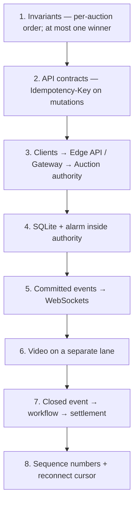

Do not start with every Cloudflare product. Each box should solve a requirement or failure already
discussed.

## Likely interviewer pushback

### Why not Kafka plus a conventional database?

Kafka with a normal database is a valid design. A command log split by auction ID can also order
actions. You would still need to coordinate the log consumer, database transactions, idempotency
records, timers, and live gateways. A Durable Object puts those jobs into one execution and
storage boundary for each auction. Kafka may be a better fit when portability or very high total
event throughput matters, or when the company already runs Kafka.

### Why not put every viewer socket on the authority object?

Bid decisions and socket delivery would compete for the same object. A slow or very large audience
could delay bids. Fanout shards handle sockets and broadcasts, while the authority remains the only
auction state machine.

### What if the bid commits but event publication fails?

The bid stays saved. A reconnect repairs the viewer's state from the authority or history. In this
prototype, publication happens after the commit. If publication fails, a connected viewer may not
see the update until a later refresh. A production system should save events in a transactional
outbox and retry publication until it succeeds. The current `waitUntil` call does not close this
gap.

### How do you prevent fake bidders or cross-auction demo credentials?

The edge verifies the JWT signature, issuer, audience, expiry, subject, and role. Demo tokens in the
browser also name one auction, and middleware checks that scope before it looks up the object. A
production system would also check account status, auction membership, payment eligibility, risk,
and possibly bid limits. The prototype only uses the role claim for authorization.

### What happens with 100,000 viewers on one lot?

Do not make the authority send to 100,000 sockets. Add delivery shards, assign each viewer to one
shard, limit the number of sockets on each shard, and recover with bounded replay plus official
history. Load tests and capacity plans should determine the number of shards. Correctness does not
depend on a fixed count.

### Can you guarantee fairness for a bidder on another continent?

The system guarantees one official commit order. It does not guarantee click order or equal
network delay. Client timestamps can be false or have clock errors, so they cannot set the order.
Proxy bidding, longer anti-snipe extensions, or regional eligibility rules can reduce the effect.
True active-active bid acceptance would need consensus on each auction's order.

### Is the auction closed exactly once?

Closing is idempotent and saves one official close event. The alarm may run more than once, and a
payment message may arrive more than once. Consumers still need idempotency. Say "one durable state
change," not "the network runs once."

## What the working project proves

Use the working code as evidence for the design. It does not replace the explanation:

| Design claim                              | Project evidence                                                                                                                                       |
| ----------------------------------------- | ------------------------------------------------------------------------------------------------------------------------------------------------------ |
| Edge authentication and schema validation | [`src/index.ts`](./src/index.ts), [`src/auth.ts`](./src/auth.ts)                                                                                       |
| One authority selected by auction ID      | [`src/index.ts`](./src/index.ts), [`src/auction.ts`](./src/auction.ts)                                                                                 |
| Transactional state and idempotency       | [`src/auction.ts`](./src/auction.ts)                                                                                                                   |
| Typed event and API boundaries            | [`src/model.ts`](./src/model.ts), [`openapi.yaml`](./openapi.yaml)                                                                                     |
| Sharded recoverable WebSocket delivery    | [`src/fanout.ts`](./src/fanout.ts)                                                                                                                     |
| Contention, alarms, roles, and reconnects | [`test/auction.spec.ts`](./test/auction.spec.ts), [`test/durable-object.integration.spec.ts`](./test/durable-object.integration.spec.ts)               |
| Deployed end-to-end behavior              | [`scripts/production-integration.ts`](./scripts/production-integration.ts), [`artifacts/integration-report.html`](./artifacts/integration-report.html) |

The project does not prove real payment eligibility, video ingest, searchable catalogs, dynamic
fanout shard assignment, support for 100,000 viewers, or transactional outbox delivery. Those are
still production work.

## Common interview mistakes

- Starting with product names instead of requirements and invariants.
- Saying a cache or WebSocket server owns the current price.
- Using client timestamps to decide whether a deadline bid counts.
- Saying "exactly once" without explaining safe retries and message delivery.
- Adding Kafka, queues, D1, KV, and multiple regions before completing one correct bid flow.
- Ignoring the response-lost-after-commit case.
- Letting fanout failure roll back or invalidate an accepted bid.
- Claiming fixed per-object throughput without a benchmark.
- Spending half the interview on video encoding when bid correctness is the core problem.

## 1. Requirements and rules

Assume an English auction with one lot. It uses server time, integer minor currency units, minimum
bid increases, and an optional anti-sniping extension. The system checks payment eligibility before
bidding. It starts payment capture asynchronously after closing. If the authority may be failing,
the system protects correctness instead of accepting more bids.

These rules must always hold:

1. One auction has one order for saved state changes, and its event sequence always increases.
2. The system accepts a bid only while the auction is `LIVE`, before the official deadline, and at
   or above the current minimum.
3. One accepted action produces one durable event; a retry returns its original result.
4. The deadline, its alarm, and the state change that sets them save in one transaction.
5. Closing is idempotent and chooses at most one winner.
6. Live delivery can repeat messages or disconnect, but clients can recover from an official
   cursor.

## 2. Data and APIs

- `Auction` stores the seller, prices, state, leader, winner, bid count, settings, times, and version.
- `Bid` stores a server-generated ID, bidder, amount, accepted time, and sequence.
- `AuctionEvent` stores its type, matching payload, actor, time, and official sequence.
- `IdempotencyRecord` stores the actor, key, action type, request fingerprint, event sequence, and
  exact original response JSON. The server uses it to replay a request safely.
- `FanoutMessage` stores the resulting snapshot, event, and cursor on one delivery shard.

API choices:

- `PUT /v1/auctions/{auctionId}` uses a stable ID, so a client can safely retry creation.
- JWT `sub` gives the actor's identity. A verified `role` claim controls what the actor can do.
  Request JSON never supplies the bidder ID.
- Every mutating `POST` requires `Idempotency-Key`.
- `GET /history?afterSequence=N` returns the official history for recovery.
- `GET /events?afterSequence=N` upgrades to a WebSocket with the `auction.v1` and `auth.<JWT>`
  subprotocols. It starts with a snapshot and missed events.
- `GET /openapi.json` returns the OpenAPI contract generated from Zod schemas.

Example bid:

```http
POST /v1/auctions/camera-001/bids
Authorization: Bearer <short-lived JWT>
Idempotency-Key: bidder-42-attempt-7
Content-Type: application/json

{"amountCents":2300}
```

## 3. Full architecture

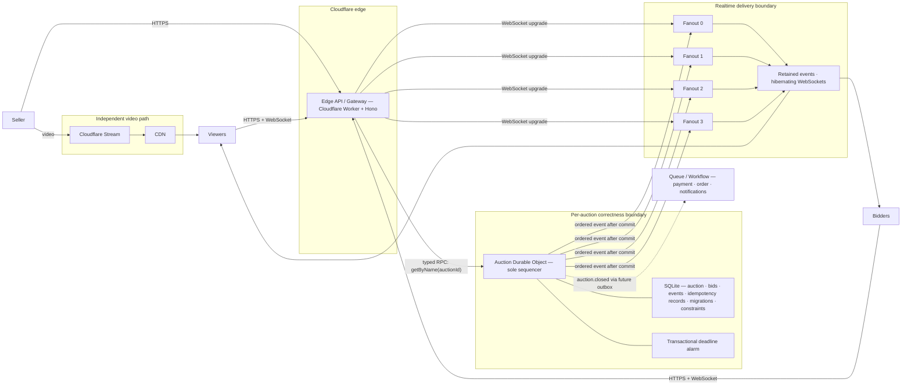

The Edge API / Gateway handles public requests but does not own auction state. A Cloudflare Worker
running Hono performs this role. Its middleware authenticates, validates, and rate limits a request
before calling the named Durable Object binding.

An `auctionStub` helper would add no value. `env.AUCTIONS.getByName(id)` already returns Cloudflare's
typed RPC reference to the remote object. Importing the `Auction` class would call local code. That
would skip the remote object's identity, storage, and ordered execution boundary.

## 4. Critical flows

### Create and start

1. Before looking up an object, the gateway verifies the JWT issuer, audience, signature, expiry,
   subject, and role.
2. Zod checks the auction ID, headers, and strict JSON body.
3. The named `Auction` object runs any pending numbered SQLite migrations.
4. One transaction inserts the draft and its `auction.created` event.
5. Start checks ownership and idempotency. The same transaction moves `DRAFT → LIVE`, saves the
   complete response for later retries, and sets the alarm.
6. After the transaction commits, the authority uses `waitUntil` to publish to fanout objects.

### Place a bid

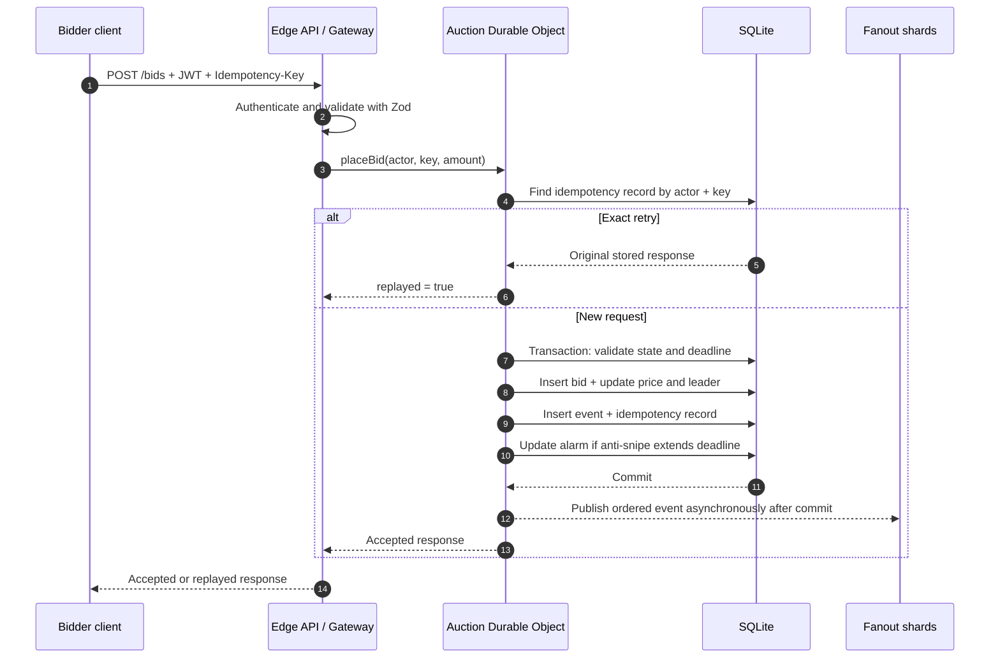

1. Rate limiting and validation happen before the authority lookup.
2. The object first looks for the `(actor, idempotency key)` record. If the fingerprint matches, it
   returns the original saved response, even if later bids happened or the deadline passed.
3. For a new request, one synchronous storage transaction checks state and time, calculates the
   minimum, inserts the bid, updates the auction, records the typed event, saves the idempotency
   record, and changes the alarm if the deadline moved.
4. Database triggers also reject impossible combinations of price, state, or sequence.
5. After the commit, the authority publishes the event and snapshot to four fanout shards.

Two equal bids can arrive at the same time. They still reach the same authority. One updates the
state first. The next sees the higher minimum and fails. The system does not need a distributed
lock.

### Close

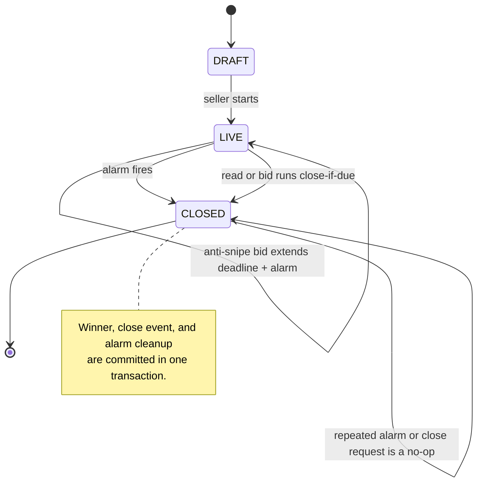

The saved server deadline is official. The close transaction moves `LIVE → CLOSED`, makes the
current leader the winner, records `auction.closed`, and clears the alarm. A repeated alarm is safe
because the auction is already closed. A read or bid also closes an overdue auction if the alarm is
late.

### Reconnect to live updates

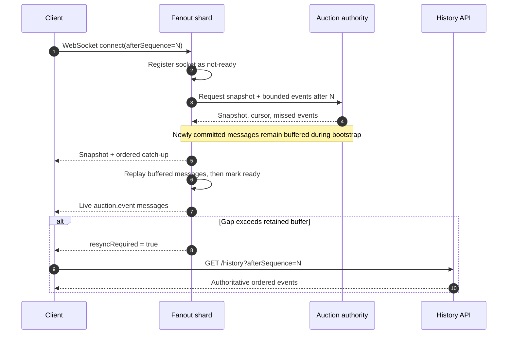

The viewer's identity maps to one of four fanout objects. The shard first marks the socket as not
ready. It asks the authority for a snapshot and a limited set of events after the requested cursor.
It then replays messages that arrived during setup and marks the socket ready. This closes the gap
between the snapshot and subscription.

Every message includes the authority's sequence number. Clients save the latest cursor, ignore
duplicates, and reconnect with `afterSequence`. They use `/history` when the snapshot sets
`resyncRequired`. Fanout may deliver a message more than once. Durable idempotency makes an action
change state effectively once when a client reuses its key.

## 5. What happens when something fails

| Failure                         | What the system does                                                     |
| ------------------------------- | ------------------------------------------------------------------------ |
| A successful response is lost   | Retry the same key and receive the exact original snapshot and event.    |
| The same key has different data | Return `IDEMPOTENCY_KEY_REUSED` because the fingerprint does not match.  |
| Equal bids arrive together      | Commit one transaction first. The next one reads the new state.          |
| The authority restarts          | Restore correct state from SQLite, the alarm, and idempotency records.   |
| The alarm repeats or is late    | Close safely more than once. Reads and bids also close overdue auctions. |
| Fanout publication fails        | Keep the bid. Repair delivery from a snapshot or history.                |
| A socket drops during setup     | Reconnect with the cursor and safely repeat the setup.                   |
| One fanout shard is full        | Return 503 there. Other shards and bid acceptance keep working.          |
| The payment provider fails      | Keep the auction closed. A future Workflow retries settlement.           |
| The authority is unavailable    | Reject or time out bids for that auction instead of risking two winners. |

## 6. Scale and Cloudflare limits

Different auction IDs use different objects and scale horizontally. One popular auction still has
one writer on purpose, so its bid throughput is limited by the sequential work of one object. Four
delivery shards keep viewer socket work away from the authority, but four is only the prototype's
fixed count. A production system can choose the count from audience forecasts or use an assignment
directory.

The object's location affects latency. A global audience must send bids to one physical authority.
Placing it near the seller or most bidders helps. Accepting bids in several primary regions would
need consensus and bring back the complexity that this design avoids.

Cloudflare puts compute, object identity, SQLite, alarms, and hibernating sockets on one platform.
The cost is vendor-specific code, migrations, limits, and operations. Rate limiting helps control
abuse, but it does not protect auction correctness. Staging tests on Cloudflare are still needed
because local tests cannot prove routing, placement, alarms, or platform limit behavior.

## 7. Other production systems

- D1 or another database stores a searchable catalog, seller dashboards, and archive read models. It
  never decides whether to accept a bid.
- Cloudflare Stream carries video on a separate path. Clients show price and deadline from auction
  events because the video may lag.
- Queues and Workflows read a transactional outbox for payment capture, orders, notifications,
  analytics, and retries.
- An external OIDC provider supplies short-lived JWTs and a remotely rotated JWKS. The application
  may need to look up roles or membership instead of trusting a general identity-provider claim.
- Logs and traces connect `X-Request-Id`, `CF-Ray`, auction ID, event sequence, and asynchronous
  settlement IDs.

## Final interview summary

> The system splits work by auction ID. One Durable Object gives each auction one official order
> for saved changes. It also owns the auction's transactional state and deadline. Hono routes and
> Zod validate edge requests, and verified JWT claims identify the actor. SQLite transactions,
> database rules, and saved idempotency responses protect bids. Alarms and recovery paths create
> one durable close change. Four hibernating fanout objects send ordered events without deciding
> auction state. Cursors and history repair gaps after a disconnect. Video and settlement run
> separately and asynchronously.
